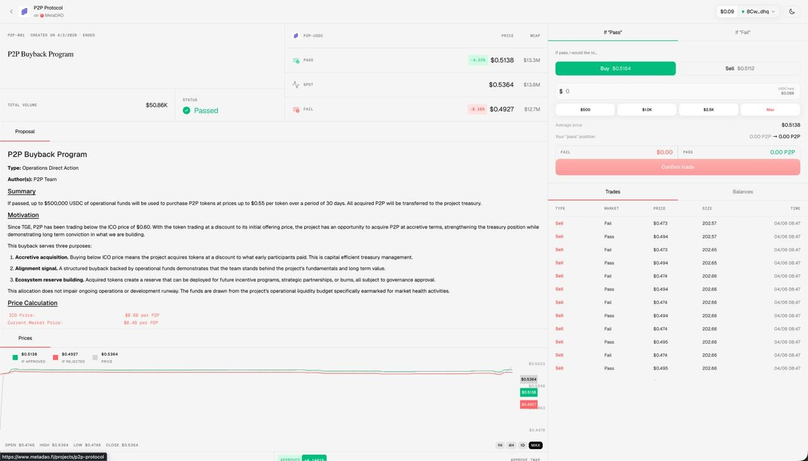

# MetaDAO Design Challenge

A redesign of MetaDAO's decision market trade page.

**Live demo:** [metadao-design-challenge.vercel.app/proposals/p2p-001](https://metadao-design-challenge.vercel.app/proposals/p2p-001)

---

## The Challenge

MetaDAO is building towards internet capital markets that work. Their existing decision market trade page is functional but lacks the credibility and professionalism needed to earn the trust of founders and investors — not just traders.

The goal: redesign the page to feel clean, trustworthy, and compelling.

### Original design

### Design brief

> *It's visually fine, but it doesn't come across as clean, professional, and credible as we'd like. It's not just about building a product that traders want to use, it's about building a product that founders and investors want to trust.*

References cited: Bloomberg, Vanguard, Fidelity, EDGAR, Berkshire Hathaway, Sequoia, a16z, Circle, Squads, Ellipsis Labs, Jito.

---

## What I Built

A proposal overview page for the **P2P Buyback Program** — the view a user lands on before trading. The design prioritizes legibility and credibility over density.

### Features

- **Proposal header** — status, title, volume, author, and proposal type with a MetaDAO watermark
- **Proposal content** — structured markdown with section headers and body copy
- **P2P price card** — live price with a 15-second countdown timer, looping price animation, and green/red flash on up/down moves
- **Proposal results** — animated PASS/FAIL bars that play through the full OHLC price history on load, with ease-out timing. Price, market cap, and percentage all animate in sync
- **Proposal trading chart** — three-line chart (pass, fail, spot) with persistent hover dots that snap back to line ends on mouse leave, custom date label on hover, no axes or crosshairs
- **Frosted glass nav** — sticky header with backdrop blur so content scrolls behind it
- **Hover states** — coordinated icon + text transitions throughout the sidebar and header

### Tech stack

- Next.js 16 (App Router)
- React 19
- TypeScript
- Tailwind CSS v4
- [lightweight-charts](https://github.com/tradingview/lightweight-charts) v5 for the trading chart

---

## Background: How Conditional Markets Work

MetaDAO's decision markets let users trade tokens conditional on a proposal passing or failing. If the proposal doesn't pass, trades are reverted — so prices reflect the market's belief in the outcome.

- **Pass price** — implied token value if the proposal is approved
- **Fail price** — implied token value if the proposal is rejected
- **Spot price** — current market price regardless of outcome

The ratio of pass to fail price gives a real-time probability estimate of whether a proposal will pass.
